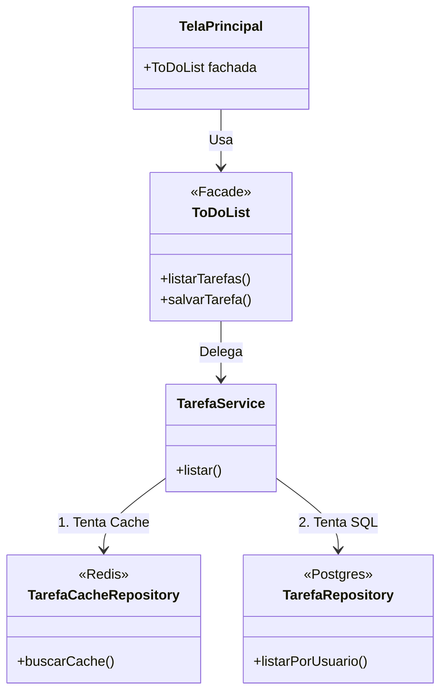
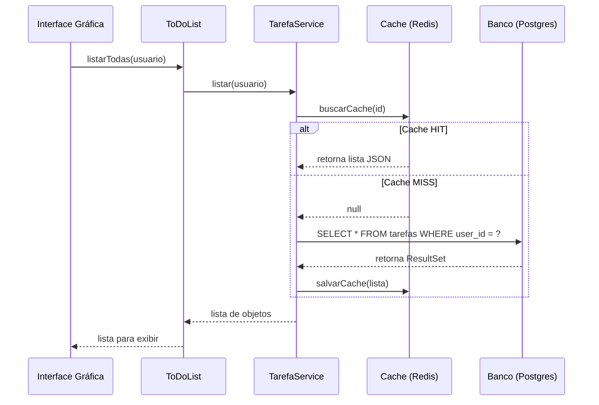

# 📘 Manual Técnico - ToDoList v2.0

## 1. Visão Geral
O **ToDoList v2.0** é um sistema de gerenciamento de tarefas robusto, desenvolvido em **Java 17**, focado em Escalabilidade, Segurança e Manutenibilidade. O sistema abandonou a antiga arquitetura de arquivos locais para adotar uma abordagem **Enterprise** distribuída.

## 2. Tecnologias & Stack
| Camada | Tecnologia | Função |
| :--- | :--- | :--- |
| **Linguagem** | Java 17 | Core do sistema |
| **Build** | Gradle | Automação e Dependências |
| **Banco Relacional** | PostgreSQL (Docker) | Persistência principal (Usuários, Tarefas) |
| **Banco NoSQL** | MongoDB (Docker) | Armazenamento de Subtarefas (Documentos) |
| **Cache** | Redis (Docker) | Cache de alta performance para listagens |
| **ORM** | Hibernate / JPA | Abstração de Banco de Dados |
| **Segurança** | BCrypt | Hashing de senhas |
| **Relatórios** | iText (PDF) / CSV | Geração de documentos |
| **Container** | Docker Compose | Orquestração da infraestrutura |

## 3. Arquitetura de Software
O sistema segue o padrão **MVC (Model-View-Controller)** com forte desacoplamento via **Interfaces**.

### 3.1 Padrões de Projeto (Design Patterns) Aplicados
1.  **Facade (`ToDoList.java`)**: Esconde a complexidade dos subsistemas (Services/Repositories). A UI conversa *apenas* com essa classe.
2.  **Singleton (`DatabaseManager.java`)**: Garante uma única instância de conexão com o Banco de Dados.
3.  **Strategy (`FiltroStrategy`, `OrdenacaoStrategy`)**: Permite trocar algoritmos de filtragem e ordenação em tempo de execução sem alterar o código principal.
4.  **Observer (`IObserver`, `ISubject`)**: A UI (`TelaListarTarefas`) observa mudanças no Service. Quando uma tarefa muda, a tela se atualiza automaticamente.
5.  **Builder (`TarefaBuilder`)**: Facilita a criação de objetos complexos (Tarefas) de forma fluente e legível.
6.  **Template Method (`RelatorioTemplate`)**: Padroniza o esqueleto da geração de relatórios (Cabeçalho, Corpo, Rodapé), permitindo variações (PDF, CSV) apenas implementando os detalhes.
7.  **Cache-Aside**: Estratégia de cache onde o sistema busca primeiro no Redis; se falhar, busca no Banco e popula o Redis.

## 4. Estrutura de Pastas (Source)
```
src/main/java
├── builders/          # Padrão Builder
├── controle/          # Controllers e Services
├── factories/         # Factory Method para injeção de dependência
├── interfaces/        # Contratos (Separados por tipo: repositories, services, strategies...)
├── modelo/            # Entidades (JPA/Hibernate)
├── negocio/           # Fachada (Facade)
├── persistencia/      # Gerenciadores de Conexão (JPA)
├── relatorios/        # Template Method de Relatórios
├── repositorios/      # Implementações de acesso a dados (DAO/Repository)
├── strategies/        # Algoritmos de filtro/ordenação
└── telas/             # Interface Gráfica (Swing)
```

## 5. Fluxo de Execução (Exemplo: Listar Tarefas)
1.  **UI**: User clica em "Listar". `TelaGerenciador` chama `fachada.listarTodas()`.
2.  **Facade**: `ToDoList` delega para `TarefaController`.
3.  **Controller**: Valida sessão e chama `TarefaService`.
4.  **Service (Proxy/Cache)**:
    *   Verifica **Redis** (Cache Hit?). Se sim, retorna.
    *   Se não, consulta **PostgreSQL** (`TarefaRepository`).
    *   Salva o resultado no Redis para futuras consultas.
5.  **Retorno**: Dados voltam para a UI.

## 6. Diagramas Arquiteturais

### 6.1 Diagrama de Classes Simplificado (Facade Pattern)


### 6.2 Fluxo de Listagem (Cache-Aside)


## 7. Segurança
*   **Autenticação**: Login obrigatório.
*   **Isolamento**: Todas as queries SQL filtram explicitamente pelo `ID` do usuário logado. Um usuário jamais vê tarefas de outro.
*   **Senhas**: Armazenadas com Hash `BCrypt`.

## 7. Como Rodar
1.  Subir infraestrutura: `docker-compose up -d`
2.  Compilar e Testar: `./gradlew clean build`
3.  Executar: `./gradlew runGUI`
